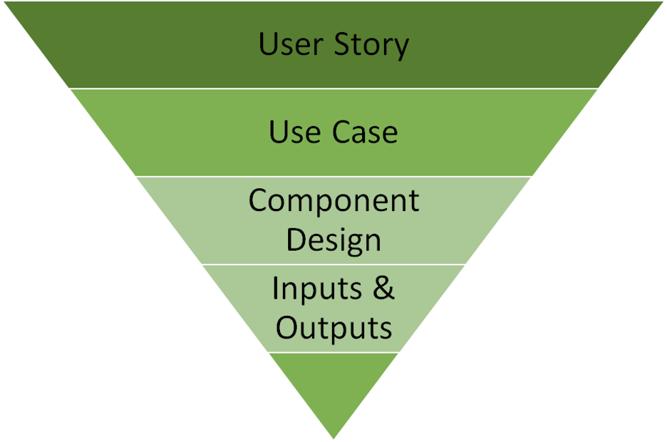

# PO-HAO is adorable
# Goal of this project

## Establish a supervised neural network predicting the lifetime of the battery

1. I’d like to give the model a “database” of battery data, and given said data, split into a test and dev data sets, train a model with the training dataset, and test the trained model against the dev set, and give an “accuracy” of how well we can predict the end of the batteries “1st life” (ie when the batteries initial discharge capacity decreases 80% of its original capacity) with as few initial cycles as possible…
2. Enter the known data set with chem
3. Use case 1, looking at different conditions
4. One is you start with viewing known data sets, and it will tell you an estimate battery life, how does the performance vary with outside, from a real world data 

## Build an unsupervised model that recommends a few possible material to synthesize batteries with desired lifetime.
1. Give an estimated life time of battery, and model suggests which chemistry is the best to use.
2. Enter the life time of a battery, and output the best “battery” to get said cycle life that you want

## Vary the number of charging/discharging cycles (input to our model) and discuss the its effect on predicting accuracy 
> - __Main goal__: Enter how confidence the user wants on the lifetime predictions, and return how many cycles they need to provide
>     - _To compare how many input cycles do we need to input into a model to get the same performance/accuracy of without having the full data set_
>     - _How many data do we need to train the model to make the model more accurate_
>     - _I use only one cycle → NNOO → results will be bad_

## Methods?
1. Time Series Analysis
2. Physics informed neural network + Transformer?
3. Cycle images -> CNN -> extracted features -> NN -> battery lifetime
4. Conditional GAN to suggest material for batteries with desired lifetime.

## Some hints
__user_story_hierachy__

__steps_in_design__

