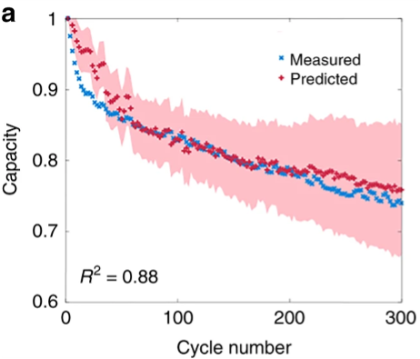

# User Story 2 - Battery Researcher
## Use Case
estimate/predict battery life on as few cycles as possible with a high level of confidence 

## Background
Paul is a battery researcher. He has been working in the battery field for over 10 years. He __wants to predict how long battery life will be without testing it for days.__ He usually assembles different kinds of batteries, like different types of cathode or anode. With the tool, he could find a battery that have better performance. Paul doesn’t have a software technical background, he is only good at excel or some other analytical tools. Paul is looking for something that helps him test the battery degradation in a more efficient way, and output lifetime of the battery.

## Component Design - Describe what the system does?
- User: Input the file which have first few cycles of the battery
- System: Read the file
- System: Processes database files into workable dataframe
- System: Displays what variables/column headers were extracted
- System: Asks user to select features of interest to train model on, and suggests recommendations based on the data extracted from the column headers 
- User: Inputs features of interest
- System: Recognizes Ambient temperature was selected as a feature
- System: Displays all ambient temperatures tested within the dataframe, and prompts user for temperature(s) to train model on
- User: Selects ambient temperature(s) of interest
- System: Reprocess dataframe to work only with users selected ambient temperature
- System: Tests for various (linear) correlations within dataframe of selected features
- System: Outputs correlations and asks user what to train model on 
- User: selects feature(s) to train model
- System: Selects “best” correlation to train model
- System: Trains ML model on random sample within the dev data frame containing features of interest
- System: Trained ML model is tested on the test data frame dataframe containing features of interest to compare 1) capacity retention prediction and/or 2) estimated cycle # at which 80% capacity with #% confidence
- System: 
- System: Asks user to select the plot graph of interest (for example, cycle number vs. capacity)
- User: Select plot graph that interest
- System: output the graph User selected

- Sample graph (ref?) 

